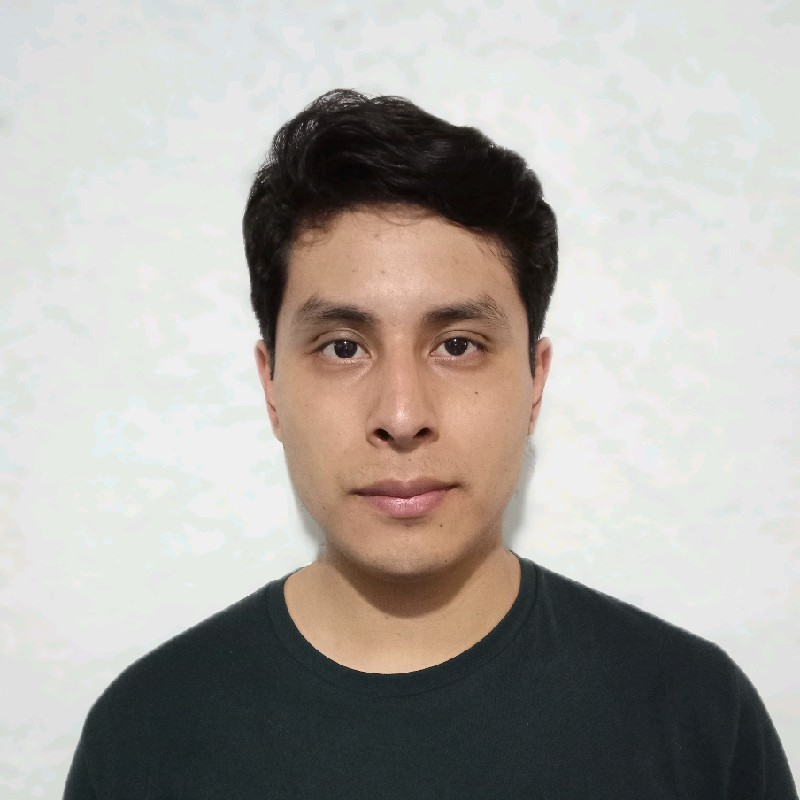

    

            
    

	

      <h3 style="color: black; margin-bottom: 3px;">
      	José Manuel Del villar Soriano    
      </h3>
      <h3 style="color: black; margin-top: 3px; margin-bottom: 3px;">
       FullStack Developer
      </h3>
      <h6 style="color: black; margin-top: 3px; margin-bottom: 3px;">
        Oaxaca de Juárez, México
      </h6>
      <h6 style="color: black; margin-top: 3px; margin-bottom: 3px;">
      	 +52 951 100 62 11
      </h6>
      <h6 style="color: black; margin-top: 3px; margin-bottom: 3px;">
      	 manuel.delvillar.soriano@outlook.com    
      </h6>
      <h6 style="color: black; margin-top: 3px; margin-bottom: 3px;">
          <a href="https://www.linkedin.com/in/jos%C3%A9-manuel-del-villar-soriano-18531678/">LinkedIn</a> 
      </h6>
      <h6 style="color: black; margin-top: 3px; margin-bottom: 3px;">
          <a href="https://www.github.com/ziceck">GitHub </a>
      </h6>  
    

 
 

### About me 

FullStack Java/Angular developer with 3+ years of experience developing web applications, participating in various activities within the software development cycle (planning, requirements definition, user stories, design and prototype, unit testing, deployment, maintenance).

 
 

### Personal skills 

- Teamwork
- Time managament
- Responsible
- Proactive
- Communication

 
 

### Languages & Frameworks 

- Grails & Groovy
- Spring & Java
- Angular & TypeScript
- Bootstrap
- ORM (Hibernate/GORM)
- Gradle
- CSS
- JQuery
- JavaScript
- SQL (MySQL/PostgreSQL)
- HTML
- Spring & Spring Security

 
 

### Tools 

- Android Studio
- IntelliJ IDEA
- WebStorm
- Postman
- Navicat
- AWS (RDS/Lightsail/EC2)
- Sublime Text
- Git, Github, Gitlab
- NetBeans
- Visual Studio Code
- Swagger
- Spock (TDD & BDD Grails)
- JasperReports
- CodeNarc (Quality code tool Grails)
- Linters.
- Apache/Tomcat.
- Docker.

 
 

### Professional experience 

#### December 2021 - Currently

Developer ● Web developer ● GFT Group 

**Activities:**

- Implement the functionality of the flows laid out by the UI/UX team.
- Fix bugs detected by the test team.
- Generate reusable components to be used within various projects.
- Show the functionalities to the client.
- Unit tests to ensure code quality.
- Maintenance and update of applications.

The main technologies used are **Angular & TypeScript** for the front-end, Android Studio to test the hybrid application, **Postman** to test the APIs, **npm** for package management, **WebStorm** as IDE, **Git/GitlLab** for version control.

 

#### September 2021 - Currently

Freelance developer ● FullStack developer ● PandyWare

**Activities:**

- Front-end and back-end coding.
- Deploying applications in prod enviroment.
- Fixing and maintenance of applications.
- Management of pull request, integration of changes and generation of releases.
- Unit tests to ensure code quality.
- Coding reusable components to be used within various projects.

The main technologies used are: **Git & GitHub**, **Spring & Java**, **Grails & Groovy**, **Angular & TypeScript**, **Apache & Tomcat**, **MySQL**.

 

#### September 2019 - September 2021

Developer ● FullStack developer ● Universidad LaSalle Oaxaca

**Activities:**

- Planning and definition of requirements.
- Design and prototype of views.
- Coding functionalities at the front-end and back-end level.
- Fixing and maintenance of applications.
- Unit tests to ensure code quality.
- Deploying applications in prod enviroment.

The main technologies used were **Grails & Groovy** in the back-end for the creation of REST APIs, **Angular & TypeScript** in the front-end, **MySQL/PostgreSQL** for databases, **Git/GitLab** for version control, **Tomcat & Apache** for deployment in a production environment.

 
 

### Certifications 
- [AWS Certified Cloud Practitioner](https://www.credly.com/badges/74c42821-404e-4aca-9999-22890605be27/)
- [AWS Certified Developer – Associate](https://www.credly.com/badges/f5efdf9c-d266-4a45-baa1-7778ad2ee582)

 
 

### Internship 
#### August 2018 - May 2019

Internship ● Developer ● Secretaría de Economía Oaxaca

**Activities:**

- Android application development.
- Creating APIs REST.
- Database design.
- User stories and requirements definition.
- Design and prototype of views.

The main technologies used were **Grails & Groovy** for the back-end, **Android Studio & Java** for application creation, **Git/Bitbucket** for version control handling, **Balsamic mockups** for the application layout, **MySQL** for the database.

 
 

### Education 
#### Instituto Tecnológico de Oaxaca (August 2013 - August 2019)

I studied computer systems engineering, during my studies, in teamwork we developed an augmented reality application focused on learning to read in children, which participated in national events, the technologies used were **Vuforia** and **Unity**.
