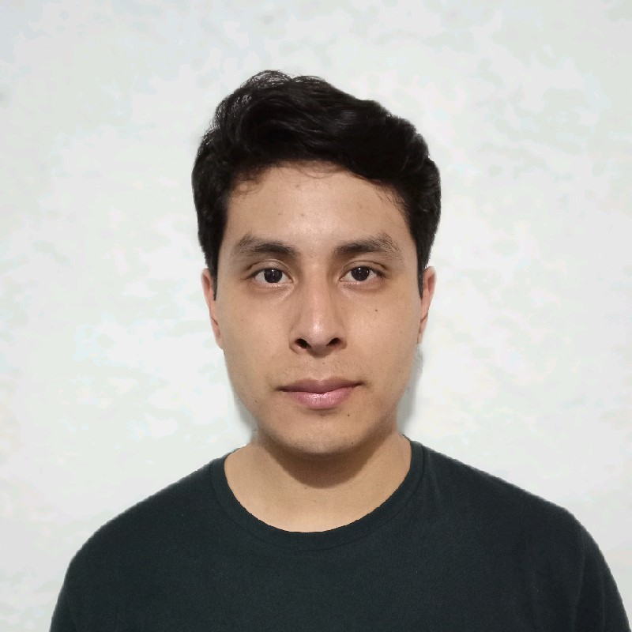

    

            
    

	

      <h3 style="color: black; margin-bottom: 3px;">
      	Manuel Del villar    
      </h3>
      <h3 style="color: black; margin-top: 3px; margin-bottom: 3px;">
       Software Engineer
      </h3>
      <h6 style="color: black; margin-top: 3px; margin-bottom: 3px;">
        Oaxaca de Juárez, México
      </h6>
      <h6 style="color: black; margin-top: 3px; margin-bottom: 3px;">
      	 +52 951 100 62 11
      </h6>
      <h6 style="color: black; margin-top: 3px; margin-bottom: 3px;">
      	 manuel.delvillar.soriano@outlook.com    
      </h6>
      <h6 style="color: black; margin-top: 3px; margin-bottom: 3px;">
          <a href="https://www.linkedin.com/in/jos%C3%A9-manuel-del-villar-soriano-18531678/">LinkedIn</a> 
      </h6>
      <h6 style="color: black; margin-top: 3px; margin-bottom: 3px;">
          <a href="https://www.github.com/ziceck">GitHub </a>
      </h6>
	  <h6 style="color: black; margin-top: 3px; margin-bottom: 3px;">
		   <a href="https://ziceck.github.io/index_en_be">Spanish</a>
	  </h6>
    

 
 

### About me 

Software Engineer specializing in Java, Spring Boot, and AWS, with 7+ years of experience designing, developing,
and maintaining scalable backend applications and services. Strong expertise across the software development lifecycle,
including system design, requirements analysis, technical planning, API development, unit testing, CI/CD, cloud
deployment, and production support. Experienced in building robust, scalable, and maintainable backend solutions using
Java, Spring Boot, AWS, and distributed systems, with a strong focus on performance, reliability, and clean
architecture.

 
 

### Personal skills 

- Teamwork
- Time management
- Responsible
- Proactive
- Communication
- Ownership
- Leading and mentoring

 
 

### Languages & Frameworks 

- Spring/SpringBoot & Java/Kotlin
- ORM (Hibernate/GORM)
- Gradle
- Maven
- SQL (MySQL/PostgreSQL)
- Spring Security

 
 

### Tools 

- Kafka
- CI/CD Pipelines
- AI Tool (Amazon Q, Copilot, Kiro)
- IntelliJ IDEA
- Postman
- Navicat
- AWS (RDS/DynamoDB/EC2/ECS/S3/Lambda)
- Git, GitHub, Gitlab
- Visual Studio Code
- Swagger
- JUnit & Mockito
- Linters.
- Apache/Tomcat.
- Docker.

 
 

### Professional experience 

#### November 2022 - Currently
Software Engineer ● Software Engineer II ● Western Governors University

**Activities:**
- Backend development using Java, Spring Boot, REST APIs, and distributed services.
- Database development and optimization using MySQL and Elasticsearch.
- Design, maintain, and modernize legacy backend applications and their AWS resources.
- Remediate security vulnerabilities identified through Veracode and maintain secure, reliable applications.
- Maintain CI/CD pipelines and deploy backend services across Dev, QA, and Production environments using AWS.
- Monitor and troubleshoot backend applications using New Relic and Dynatrace.
- Lead technical projects and development teams, coordinating deliverables, technical decisions, and knowledge transfer.
- Lead code reviews and ensure adherence to backend development best practices.
- Manage application release cycles and production deployments.
- Lead backend development teams and mentor engineers through technical guidance, code reviews, knowledge sharing, and best-practice adoption.
- Design and implement event-driven backend solutions using Apache Kafka/SQS for asynchronous communication, message processing, and integration between distributed services.

#### December 2021 - November 2022

Developer ● Backend Engineer ● GFT Group/Santander

**Activities:**

- Implement backend functionality and business logic based on application requirements.
- Develop and maintain RESTful APIs and reusable backend services.
- Troubleshoot and resolve defects identified during testing and production.
- Develop reusable components and services across multiple projects.
- Perform unit testing to ensure code quality, reliability, and maintainability.
- Support application maintenance, enhancements, and continuous improvements.
- Test and validate APIs using Postman and manage dependencies using Maven.
- Collaborate with clients and development teams to demonstrate and validate backend functionality.

Main technologies: Java, Spring Boot, REST APIs, MySQL, Postman, Maven, Git/GitLab, and IntelliJ IDEA.

 

#### September 2021 - October 2022

Freelance developer ● FullStack Developer ● PandyWare

**Activities:**

- Backend development focused on business logic, APIs, and application services.
- Deploy and support backend applications in production environments.
- Troubleshoot, maintain, and enhance backend services and applications.
- Manage pull requests, code integration, and backend release cycles.
- Develop unit tests to ensure code quality, reliability, and maintainability.
- Build reusable backend components and services across multiple projects.

The main technologies used are: **Git & GitHub**, **Spring & Java**, **Angular & TypeScript**, **Apache & Tomcat**, **MySQL**.

 

#### September 2019 - September 2021

Developer ● FullStack developer ●  LaSalle Oaxaca University

**Activities:**

- Analyze business requirements and translate them into technical solutions across the frontend and backend.
- Design and develop full-stack features, including responsive user interfaces, backend services, and RESTful APIs.
- Implement application functionality using modern frontend and backend technologies, ensuring seamless integration between layers.
- Troubleshoot, maintain, and enhance applications while improving performance, reliability, and maintainability.
- Develop unit tests to ensure code quality, stability, and adherence to development best practices.
- Deploy and support full-stack applications across production environments, contributing to release and operational activities.

The main technologies used were **Java & SpringBoot** in the back-end for the creation of REST APIs, **Angular & TypeScript** in the front-end, **MySQL/PostgreSQL** for databases, **Git/GitLab** for version control, **Tomcat & Apache** for deployment in a production environment.

 
 

### Certifications 
- [AWS Certified Cloud Practitioner](https://www.credly.com/badges/74c42821-404e-4aca-9999-22890605be27/)
- [AWS Certified Developer – Associate](https://www.credly.com/badges/f5efdf9c-d266-4a45-baa1-7778ad2ee582)

 
 

### Internship 
#### August 2018 - May 2019

Internship ● Developer ● Secretaría de Economía Oaxaca

**Activities:**

- Android application development.
- Creating APIs REST.
- Database design.
- User stories and requirements definition.
- Design and prototype of views.

The main technologies used were **Grails & Groovy** for the back-end, **Android Studio & Java** for application creation, **Git/Bitbucket** for version control handling, **Balsamic mockups** for the application layout, **MySQL** for the database.

 
 

### Education 
#### Instituto Tecnológico de Oaxaca (August 2013 - August 2019)

I studied computer systems engineering, during my studies, in teamwork we developed an augmented reality application focused on learning to read in children, which participated in national events, the technologies used were **Vuforia** and **Unity**.
